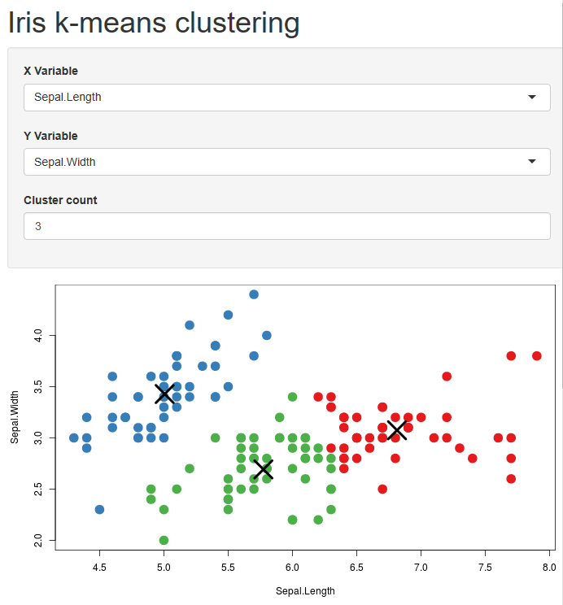
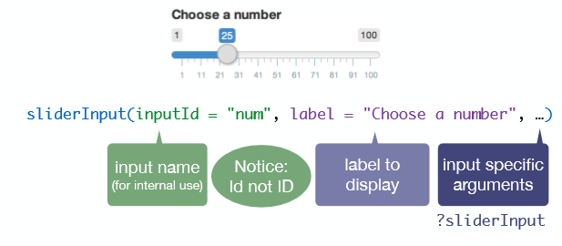
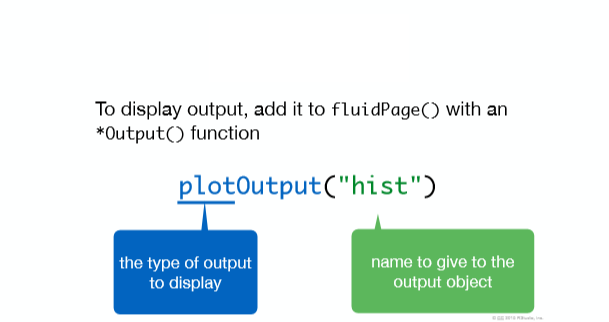
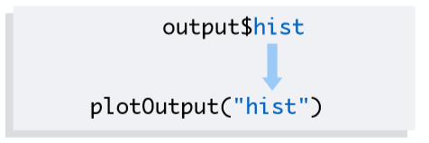
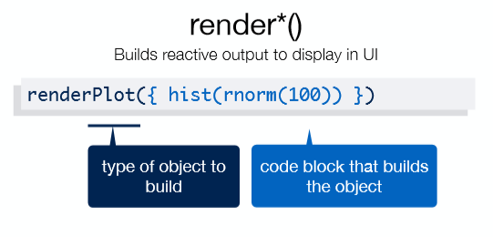

```{r setup, include=FALSE}
knitr::opts_chunk$set(echo = FALSE)
```

## What is Shiny package?

- Shiny is an R package that makes it easy to build <span style="color:red; font-weight:bold">interactive web applications</span> (apps) straight from R. This lesson will get you started building Shiny apps right away.
- Build useful web applications <span style="color:purple; font-weight:bold">with only a few lines of code</span>—no JavaScript required.
- Shiny applications are <span style="color:green; font-weight:bold">automatically “live”</span> in the same way that spreadsheets are live. Outputs change instantly as users modify inputs, without requiring a reload of the browser.
- Shiny user interfaces can be built entirely using R, or can be written directly in HTML, CSS, and JavaScript for more <span style="color:yellow; font-weight:bold">flexibility.</span>
- Pre-built output widgets for displaying <span style="color:aqua; font-weight:bold">plots, tables, and printed output of R objects.</span>

## Install Shiny Package 

If you still haven’t installed the Shiny package, open an R session, connect to the internet, and run

```r
install.packages("shiny")
```

## First App in  Shiny

```r
library(shiny)
runExample("01_hello")
```

```{r}
library(shiny)
library(shiny)

# Define UI for app that draws a histogram ----
ui <- fluidPage(

  # App title ----
  titlePanel("Hello Shiny!"),

  # Sidebar layout with input and output definitions ----
  sidebarLayout(

    # Sidebar panel for inputs ----
    sidebarPanel(

      # Input: Slider for the number of bins ----
      sliderInput(inputId = "bins",
                  label = "Number of bins:",
                  min = 1,
                  max = 50,
                  value = 30)

    ),

    # Main panel for displaying outputs ----
    mainPanel(

      # Output: Histogram ----
      plotOutput(outputId = "distPlot")

    )
  )
)


# Define server logic required to draw a histogram ----
server <- function(input, output) {

  # Histogram of the Old Faithful Geyser Data ----
  # with requested number of bins
  # This expression that generates a histogram is wrapped in a call
  # to renderPlot to indicate that:
  #
  # 1. It is "reactive" and therefore should be automatically
  #    re-executed when inputs (input$bins) change
  # 2. Its output type is a plot
  output$distPlot <- renderPlot({

    x    <- faithful$waiting
    bins <- seq(min(x), max(x), length.out = input$bins + 1)

    hist(x, breaks = bins, col = "#75AADB", border = "white",
         xlab = "Waiting time to next eruption (in mins)",
         main = "Histogram of waiting times")

    })

}

shinyApp(ui = ui, server = server)

```

## More Example

```r 
runExample("01_hello")      # a histogram
runExample("02_text")       # tables and data frames
runExample("03_reactivity") # a reactive expression
runExample("04_mpg")        # global variables
runExample("05_sliders")    # slider bars
runExample("06_tabsets")    # tabbed panels
runExample("07_widgets")    # help text and submit buttons
runExample("08_html")       # Shiny app built from HTML
runExample("09_upload")     # file upload wizard
runExample("10_download")   # file download wizard
runExample("11_timer")      # an automated timer
```

## Structure of a Shiny App {.smaller}

* Shiny apps are contained in a single script called app.R. The script app.R lives in a directory (for example, newdir/) and the app can be run with runApp("newdir").

* a user interface object (<span style="color:red; font-weight:bold">ui.r</span>)

* a server function       (<span style="color:red; font-weight:bold">server.r</span>)

* a call to the shinyApp function

```r
library(shiny)

ui <- fluidPage(
 
)

server <- function(input, output, session) {
  
}

shinyApp(ui, server)
```

## Say Hello with Shiny

```r
library(shiny)
ui <- fluidPage(
    "Hello Shiny Package"
    )

server <- function(input, output) {
    
}

shinyApp(ui = ui, server = server)
```
#### Output {#nextsteps}

```{r}
library(shiny)
ui <- fluidPage(
    "Hello Shiny Package"
    )

server <- function(input, output) {
    
}

shinyApp(ui = ui, server = server)

```

## Inputs and Outputs

Build your app around <span style="color:purple; font-weight:bold">inputs</span> and <span style="color:green; font-weight:bold">outputs</span>

### output

<div align ="center" >

</div>

## Input {.smaller}
```r
sliderInput(inputId = "num",
  label = "Choose a number",
  value = 25, min = 1, max = 100)
```
```r
library(shiny)
ui <- fluidPage(
    sliderInput(inputId = "num",
                label = "Choose a number",
                value = 25, min = 1, max = 100)
    )

server <- function(input, output) {
    
}

shinyApp(ui = ui, server = server)
```

```{r}
library(shiny)
ui <- fluidPage(
    sliderInput(inputId = "num",
                label = "Choose a number",
                value = 25, min = 1, max = 100)
    )

server <- function(input, output) {
    
}

shinyApp(ui = ui, server = server)
```

## Input Syntax
<div align="center">


</div>
## Outputs {.div1}
<div align="center">


</div>
## Entegration Input and Output

Use <span style="color:red; font-weight:bold">3 rules</span> to write the server function


```r
server <- function(input, output) {


}

```

## 1 Save objects to display to output$


```r

server <- function(input, output) {  
  output$hist <- # code
}


```
<div align="center">


</div>

## 2 Build objects to display with render*()

buraya biseyler yazilabilir

```r

server <- function(input, output) {  
  output$hist <- renderPlot({

   #code

  }) 
}

```
## `

<div align="center"  >
  
</div>

<div style="margin-left: 40px;">

```r

server <- function(input, output) {
  output$hist <- renderPlot({

    title <- "100 random normal values"           

    hist(rnorm(100), main = title) 

  }) 
}

```
</div>


## 3 Access input values with input$
<div style="margin-left: 40px;">

```r
server <- function(input, output) {  
  
  output$hist <- renderPlot({    
  hist(rnorm(input$num))  
  
  }) 

}

```
<div align="center"  >
  
</div>

</div>

## Result  (Reactivity) {.smaller}

  Reactivity automatically occurs whenever you use an input value to render an output object
  
<div style="margin-left: 40px;">
```r
library(shiny)
ui <- fluidPage(
    sliderInput(inputId = "num",
                label = "Choose a number",
                value = 25, min = 1, max = 100),
    plotOutput("hist")
    )

server <- function(input, output) {
    output$hist <- renderPlot({
        hist(rnorm(input$num))
    })
}

shinyApp(ui = ui, server = server)
```
</div>

## Code Output
<div style="margin-left: 40px;">
```{r}
library(shiny)
ui <- fluidPage(
    sliderInput(inputId = "num",
                label = "Choose a number",
                value = 25, min = 1, max = 100),
    plotOutput("hist")
    )

server <- function(input, output) {
    output$hist <- renderPlot({
        hist(rnorm(input$num))
    })
}

shinyApp(ui = ui, server = server)
```

## Using Checkbox in Shiny 
At first, we have to define UI and title
```r
library(shiny)

# Define UI for dataset viewer app ----
ui <- fluidPage(

  # App title ----
  titlePanel("Shiny Text"),
```
## Using Checkbox in Shiny {.smaller}

Then, we define the sidebar panel inputs and checkbox
```r
 # Sidebar layout with a input and output definitions ----
  sidebarLayout(

    # Sidebar panel for inputs ----
    sidebarPanel(

      # Input: checkbox for choosing dataset ----
      checkboxGroupInput("dataset", "Choose a dataset:",
                         c("rock", "pressure", "cars"),
                         selected = "rock"),

      # Input: Numeric entry for number of obs to view ----
      numericInput(inputId = "obs",
                   label = "Number of observations to view:",
                   value = 10)
    ),
```
## Using Checkbox in Shiny 
 After that, we define the main panel for displaying outputs

```r   
    mainPanel(

      # Output: Verbatim text for data summary ----
      verbatimTextOutput("summary"),

      # Output: HTML table with requested number of observations ----
      tableOutput("view")
```

## Using Checkbox in Shiny {.smaller}
At last, we define the server logic and create the shiny app

```r 
# Define server logic to summarize and view selected dataset ----
server <- function(input, output) {

  # Return the requested dataset ----
  datasetInput <- reactive({
    switch(input$dataset,
           "rock" = rock,
           "pressure" = pressure,
           "cars" = cars)
  })

  # Generate a summary of the dataset ----
  output$summary <- renderPrint({
    dataset <- datasetInput()
    summary(dataset)
  })

  # Show the first "n" observations ----
  output$view <- renderTable({
    head(datasetInput(), n = input$obs)
  })

}

# Create Shiny app ----
shinyApp(ui = ui, server = server)
```

## Checkbox Example
```{r}
library(shiny)
 
ui <- fluidPage(
  
  
  titlePanel("Shiny Text"),
  
  
  sidebarLayout(
    
   
    sidebarPanel(
      
      
      checkboxGroupInput("dataset", "Choose a dataset:",
                         c("rock", "pressure", "cars"),
                         selected = "rock"),
      
      numericInput(inputId = "obs",
                   label = "Number of observations to view:",
                   value = 10)
    ),
    
    mainPanel(
      
      verbatimTextOutput("summary"),
      
      tableOutput("view")
      
    )
  )
)
server <- function(input, output) {
  
  datasetInput <- reactive({
    switch(input$dataset,
           "rock" = rock,
           "pressure" = pressure,
           "cars" = cars)
  })
  
  output$summary <- renderPrint({
    dataset <- datasetInput()
    summary(dataset)
  })
  
  output$view <- renderTable({
    head(datasetInput(), n = input$obs)
  })
  
}
shinyApp(ui = ui, server = server)
```

