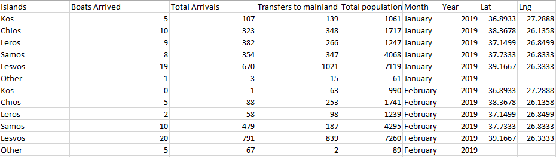
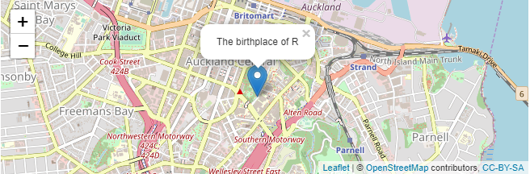

```{r setup, include=FALSE}
knitr::opts_chunk$set(echo = FALSE)
```

## Retrieving Data

 * We used Aegean Boat Report's data from: https://aegeanboatreport.com/reports/ 
 * By using Excel, we shaped this data to make it useful for our research.
 
* <div align ="center"; padding-bottom: 25px>
  
  </div>
  
## Using Leaflet

* For creating a map we used Leaflet library.
* Leaflet is a open source JavaScript library for creating interactive maps.
* It can be implemented and used in Shiny easily.
* Leaflet gives the opportunity of adding informational popups to particular part of maps.
* <div align ="center"; padding-bottom: 25px>
  
  </div>

## Result

<div align ="center"; padding-bottom: 25px>
  
  </div>
